# Bulk Property Sorter Extension Documentation

## Table of Contents

- [Overview](#overview)
  - [Supported File Types](#supported-file-types)
- [Architecture Overview](#architecture-overview)
- [Data Flow Architecture](#data-flow-architecture)
- [Core Components](#core-components)
  - [1. Extension Entry Point (`extension.ts`)](#1-extension-entry-point-extensionts)
  - [2. File Processor (`fileProcessor.ts`)](#2-file-processor-fileprocessorts)
  - [3. Core Processor (`coreProcessor.ts`)](#3-core-processor-coreprocessorts)
  - [4. Language Sorters (`languageSorters.ts`)](#4-language-sorters-languagesortersts)
  - [5. TypeScript Parser (`parser.ts`)](#5-typescript-parser-parserts)
  - [6. CSS Parser (`cssParser.ts`)](#6-css-parser-cssparsersts)
  - [7. Go Parser (`goParser.ts`)](#7-go-parser-goparsersts)
  - [8. Property Sorter (`sorter.ts`)](#8-property-sorter-sorterts)
  - [9. Reconstructors](#9-reconstructors)
- [Data Structures](#data-structures)
  - [Core Types](#core-types)
- [Processing Pipeline](#processing-pipeline)
  - [Complete Processing Flow](#complete-processing-flow)
  - [Nested Object Processing](#nested-object-processing)
- [Configuration System](#configuration-system)
  - [Configuration Options](#configuration-options)
  - [Configuration Flow](#configuration-flow)
- [Command System](#command-system)
  - [Available Commands](#available-commands)
  - [Configuration Options Detail](#configuration-options-detail)
    - [showDescendingOption](#showdescendingoption)
- [Language Support](#language-support)
  - [TypeScript/JavaScript Support](#typescriptjavascript-support)
  - [CSS/SCSS/SASS/LESS Support](#cssscssassless-support)
  - [Go Language Support](#go-language-support)
- [Recent Improvements (Version 0.4.6)](#recent-improvements-version-046)

## Overview

The Bulk Property Sorter is a VS Code extension that provides intelligent property sorting for TypeScript/JavaScript interfaces, type aliases, object literals, CSS/SCSS/SASS/LESS stylesheets, and Go struct definitions. It preserves comments, handles nested objects and CSS rules, maintains code formatting, preserves original trailing punctuation styles (semicolons, commas, or none), and supports object spread syntax while sorting properties alphabetically or in reverse order.

### Supported File Types

- **TypeScript/JavaScript**: Interfaces, type aliases, object literals, class members
- **CSS**: CSS rules, media queries, keyframes, property declarations
- **SCSS**: Nested rules, parent selectors, mixins, variables
- **SASS**: Indented syntax support without braces and semicolons
- **LESS**: Variables, mixins, nested rules, property declarations
- **Go**: Struct definitions with field sorting and tag preservation, and much more

## Architecture Overview

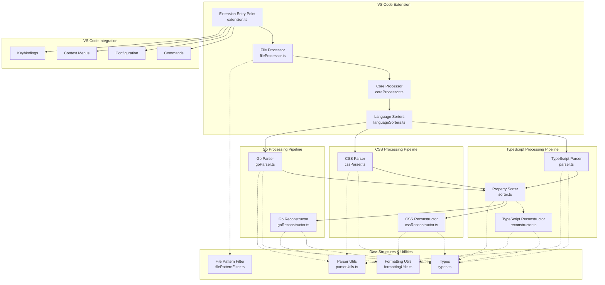

## Data Flow Architecture

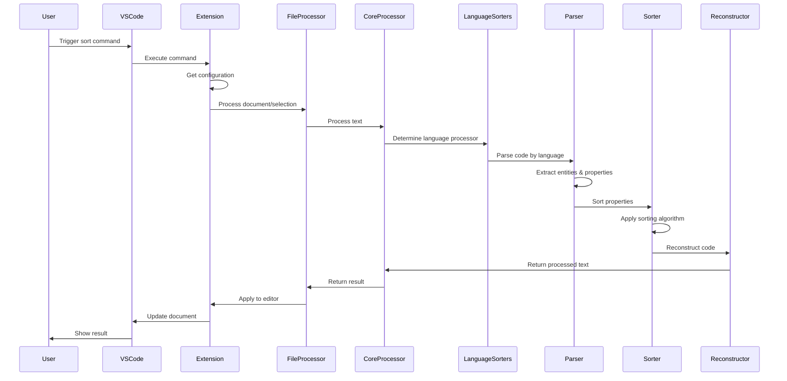

## Core Components

### 1. Extension Entry Point (`extension.ts`)

The main extension file that handles VS Code integration:

**Key Features:**
- Command registration for ascending/descending sort
- Configuration management with extensive options
- Language exclusion and file pattern filtering
- Editor integration and change application

### 2. File Processor (`fileProcessor.ts`)

Orchestrates the processing workflow with VS Code integration:

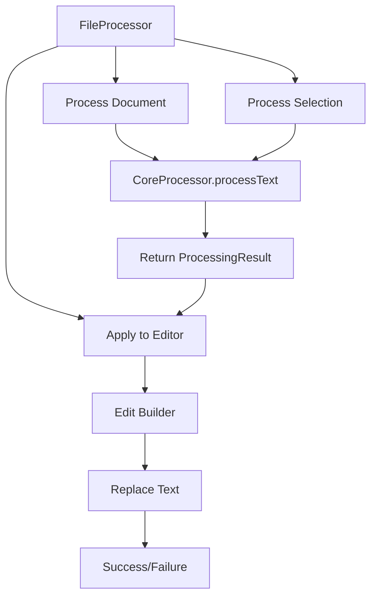

**Responsibilities:**
- VS Code document handling
- Selection processing
- Editor change application
- Error handling and user feedback

### 3. Core Processor (`coreProcessor.ts`)

The main processing engine without VS Code dependencies:

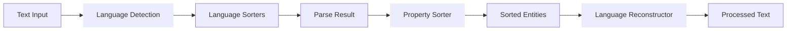

### 4. Language Sorters (`languageSorters.ts`)

Coordinates language-specific processing:

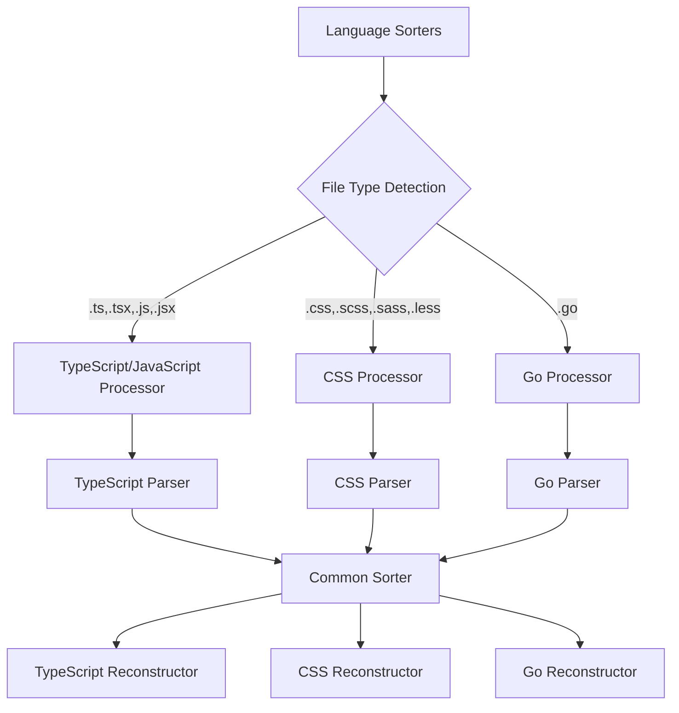

### 5. TypeScript Parser (`parser.ts`)

Parses TypeScript/JavaScript code and extracts sortable entities:

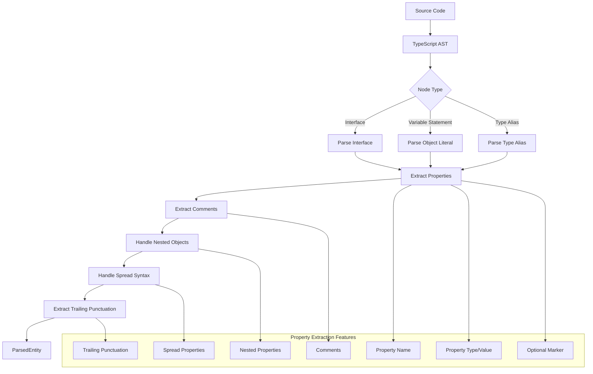

#### Semicolon Preservation Feature

The TypeScript parser includes sophisticated trailing punctuation detection to preserve the original code style during sorting operations:

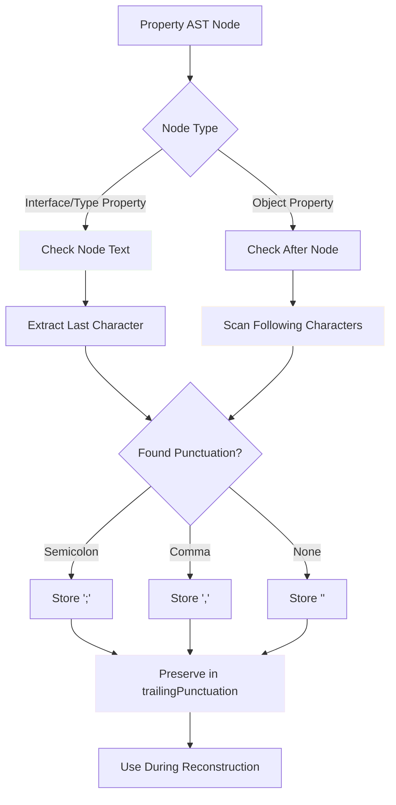

### 6. CSS Parser (`cssParser.ts`)

Parses CSS and its variants with format-specific handling:

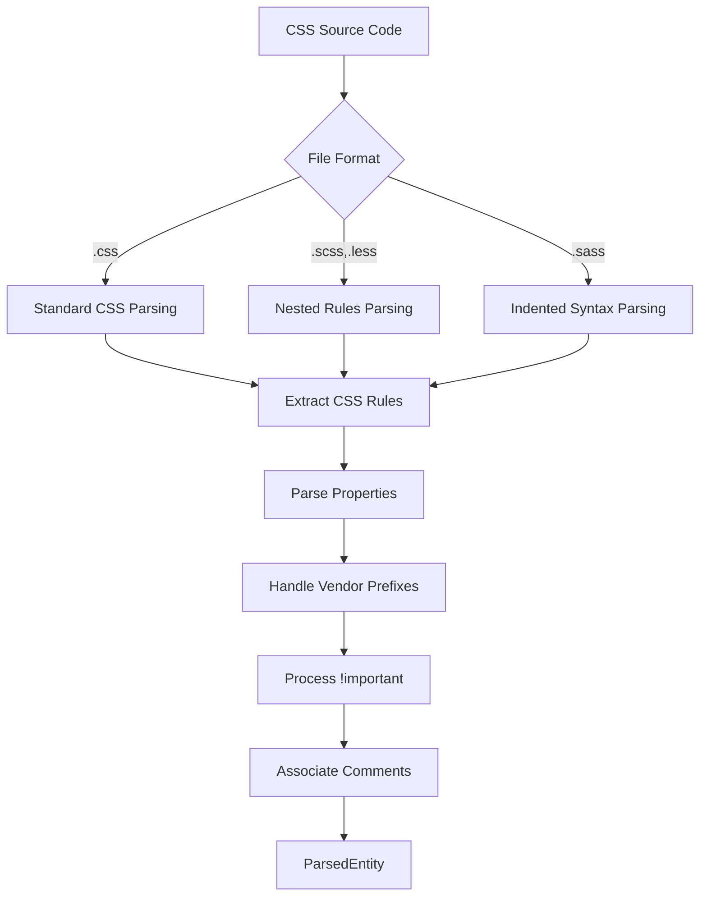

### 7. Go Parser (`goParser.ts`)

Parses Go source code and extracts struct definitions:

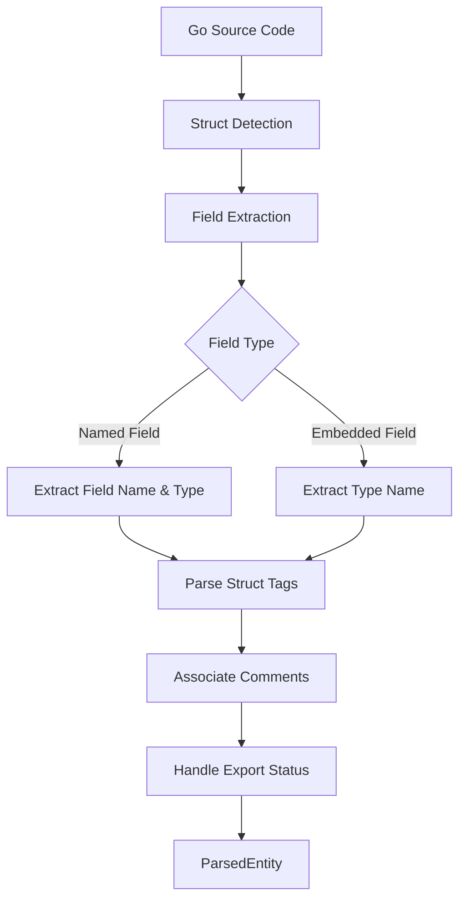

### 8. Property Sorter (`sorter.ts`)

Implements the sorting algorithm with various options:

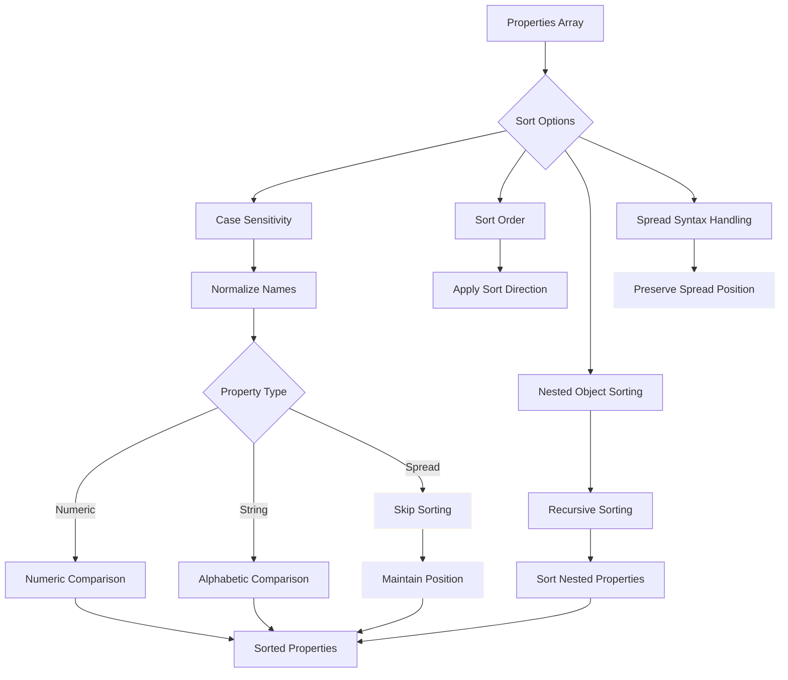

### 9. Reconstructors

Language-specific reconstructors rebuild code from sorted entities:

- **TypeScript Reconstructor** (`reconstructor.ts`): Handles interfaces, objects, and type aliases
- **CSS Reconstructor** (`cssReconstructor.ts`): Handles CSS rules and properties with format awareness
- **Go Reconstructor** (`goReconstructor.ts`): Handles Go struct definitions with tag preservation

## Data Structures

### Core Types

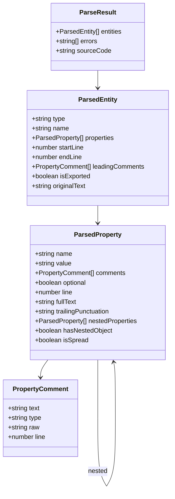

## Processing Pipeline

### Complete Processing Flow

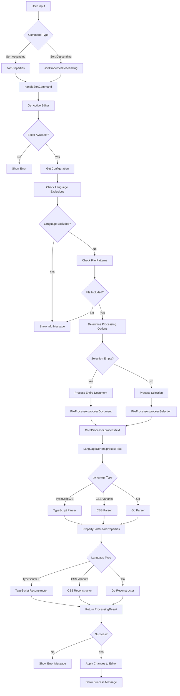

### Nested Object Processing

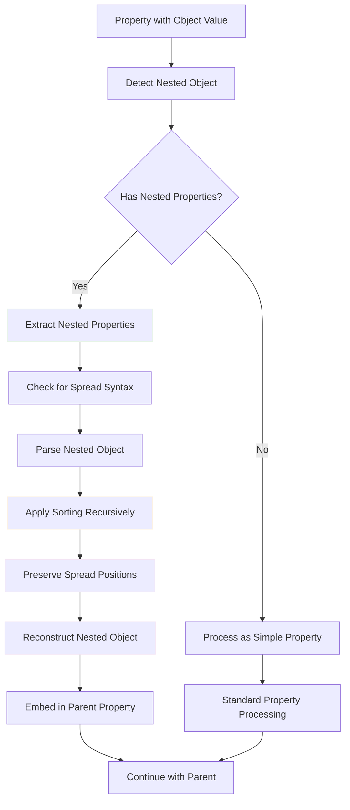

## Configuration System

### Configuration Options

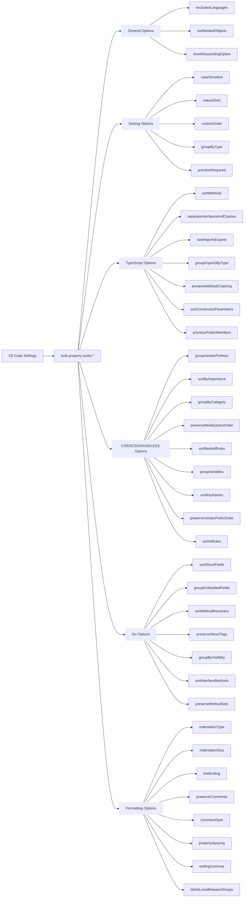

#### General Options

- **`excludedLanguages`** (`string[]`, default: `[]`): Array of language IDs where the extension should be disabled
- **`includedFilePatterns`** (`string[]`, default: `["**/*"]`): File patterns to include for sorting (glob patterns)
- **`excludedFilePatterns`** (`string[]`, default: `[]`): File patterns to exclude from sorting (glob patterns)
- **`sortNestedObjects`** (`boolean`, default: `true`): Enable/disable recursive sorting of nested object properties
- **`showDescendingOption`** (`boolean`, default: `false`): Show the "Sort Properties Descending" option in the context menu

#### Sorting Options

- **`sorting.caseSensitive`** (`boolean`, default: `true`): Enable case-sensitive property sorting
- **`sorting.naturalSort`** (`boolean`, default: `false`): Enable natural sort order for properties containing numbers
- **`sorting.customOrder`** (`string[]`, default: `[]`): Custom property order list - properties matching these names will be sorted first
- **`sorting.groupByType`** (`boolean`, default: `false`): Group properties by their type before sorting alphabetically
- **`sorting.prioritizeRequired`** (`boolean`, default: `false`): Sort required properties before optional ones

#### TypeScript-Specific Options

- **`typescript.sortMethods`** (`string`, default: `"alphabetical"`): Method sorting preference for TypeScript classes
  - `"alphabetical"`: Sort by method name
  - `"visibility"`: Group by public/private/protected
  - `"static-first"`: Put static methods first
  - `"lifecycle"`: Follow component lifecycle order
- **`typescript.separateInterfacesAndClasses`** (`boolean`, default: `false`): Handle interfaces and classes with different sorting rules
- **`typescript.sortImportsExports`** (`boolean`, default: `false`): Sort import and export statements alphabetically
- **`typescript.groupImportsByType`** (`boolean`, default: `true`): Group imports by type: external libraries, internal modules, relative imports
- **`typescript.preserveMethodChaining`** (`boolean`, default: `true`): Preserve method chaining order in object properties
- **`typescript.sortConstructorParameters`** (`boolean`, default: `false`): Sort constructor parameters alphabetically
- **`typescript.prioritizePublicMembers`** (`boolean`, default: `false`): Sort public class members before private/protected

#### CSS/SCSS/SASS/LESS Options

- **`css.groupVendorPrefixes`** (`boolean`, default: `true`): Group vendor-prefixed properties together
- **`css.sortByImportance`** (`boolean`, default: `false`): Sort properties with `!important` declarations first
- **`css.groupByCategory`** (`boolean`, default: `false`): Group CSS properties by category before sorting alphabetically
- **`css.preserveMediaQueryOrder`** (`boolean`, default: `true`): Preserve the original order of media queries
- **`css.sortNestedRules`** (`boolean`, default: `true`): Sort nested rules in SCSS/SASS/LESS files
- **`css.groupVariables`** (`boolean`, default: `true`): Group CSS custom properties at the beginning of rule blocks
- **`css.sortKeyframes`** (`boolean`, default: `false`): Sort keyframe percentages in `@keyframes` rules
- **`css.preserveVendorPrefixOrder`** (`boolean`, default: `true`): Preserve the standard order of vendor prefixes
- **`css.sortAtRules`** (`boolean`, default: `false`): Sort `@import`, `@use`, `@forward` statements alphabetically

#### Go-Specific Options

- **`go.sortStructFields`** (`string`, default: `"alphabetical"`): Struct field sorting preference
  - `"alphabetical"`: Sort by field name
  - `"by-type"`: Group by field type
  - `"by-size"`: Order by memory size
  - `"preserve-tags"`: Maintain fields with struct tags together
- **`go.groupEmbeddedFields`** (`boolean`, default: `true`): Group embedded struct fields at the beginning
- **`go.sortMethodReceivers`** (`boolean`, default: `false`): Sort methods by receiver type name
- **`go.preserveStructTags`** (`boolean`, default: `true`): Preserve struct tag formatting and order
- **`go.groupByVisibility`** (`boolean`, default: `false`): Group exported fields before unexported fields
- **`go.sortInterfaceMethods`** (`boolean`, default: `true`): Sort method signatures alphabetically within interfaces
- **`go.preserveMethodSets`** (`boolean`, default: `false`): Keep related methods together based on functionality

#### Formatting Options

- **`formatting.indentationType`** (`string`, default: `"auto"`): Indentation type to use
  - `"auto"`: Detect from editor settings
  - `"spaces"`: Use spaces
  - `"tabs"`: Use tabs
- **`formatting.indentationSize`** (`number`, default: `4`): Number of spaces for indentation when using spaces
- **`formatting.lineEnding`** (`string`, default: `"auto"`): Line ending style
  - `"auto"`: Detect from file or use platform default
  - `"lf"`: Unix-style (`\n`)
  - `"crlf"`: Windows-style (`\r\n`)
- **`formatting.preserveComments`** (`boolean`, default: `true`): Whether to preserve comments in the output
- **`formatting.commentStyle`** (`string`, default: `"preserve"`): Comment formatting style
  - `"preserve"`: Keep original style
  - `"single-line"`: Convert to `//`
  - `"multi-line"`: Convert to `/* */`
- **`formatting.propertySpacing`** (`string`, default: `"compact"`): Property spacing style
  - `"compact"`: Use minimal spacing
  - `"spaced"`: Add space around colons
  - `"aligned"`: Align property values
- **`formatting.trailingCommas`** (`string`, default: `"preserve"`): Trailing comma handling
  - `"preserve"`: Keep original
  - `"add"`: Ensure trailing commas
  - `"remove"`: Remove trailing commas
- **`formatting.blankLinesBetweenGroups`** (`boolean`, default: `false`): Add blank lines between property groups

## Command System

### Available Commands

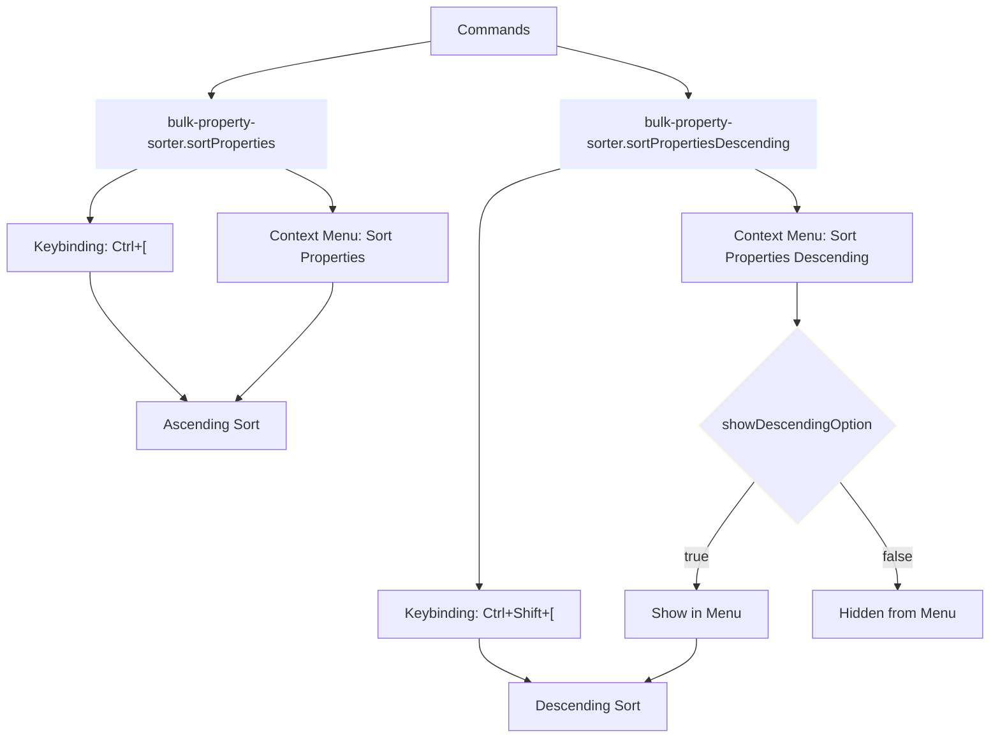
